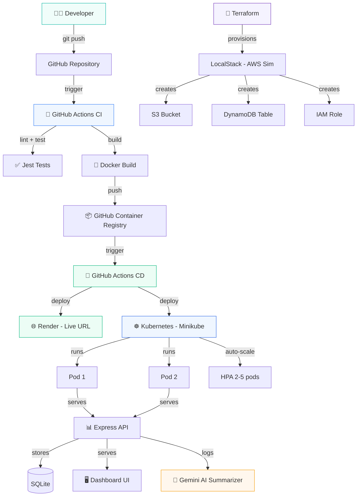

# 🏗️ CloudForge — End-to-End DevOps Pipeline

> Push code → Auto-build → Auto-test → Auto-deploy → AI-powered monitoring  
> **Zero manual steps. Zero cost. Production-grade DevOps.**


---

## 📋 What Is This?

CloudForge is a **complete DevOps pipeline** that demonstrates every major concept a DevOps engineer needs to know:

- ✅ **Containerization** — Docker multi-stage builds
- ✅ **Infrastructure as Code** — Terraform provisioning
- ✅ **Container Orchestration** — Kubernetes on Minikube
- ✅ **CI/CD** — GitHub Actions automated pipeline
- ✅ **Zero-downtime deploys** — Kubernetes rolling updates
- ✅ **Monitoring Dashboard** — Real-time build/deploy visibility
- ✅ **AI-powered log analysis** — Gemini API integration

Everything runs on **free tools** — no cloud bills, no credit cards.

---

## 🏗️ Architecture



---

## 🚀 Quick Start

### Prerequisites

| Tool | Version | Install |
|------|---------|---------|
| Node.js | ≥ 18 | [nodejs.org](https://nodejs.org) |
| Docker Desktop | ≥ 20 | [docker.com](https://docker.com/products/docker-desktop) |
| Terraform | ≥ 1.0 | `winget install Hashicorp.Terraform` |
| Minikube | ≥ 1.30 | `winget install Kubernetes.minikube` |
| kubectl | ≥ 1.28 | Included with Docker Desktop |
| Git | ≥ 2.0 | [git-scm.com](https://git-scm.com) |

### 1. Run Locally (No Docker)

```bash
cd app/backend
npm install
npm start
# Dashboard at http://localhost:3000
```

### 2. Run with Docker

```bash
# Build the image
docker build -t cloudforge:latest .

# Run the container
docker run -p 3000:3000 cloudforge:latest
# Dashboard at http://localhost:3000
```

### 3. Run with Docker Compose (App + LocalStack)

```bash
docker compose up
# App at http://localhost:3000
# LocalStack at http://localhost:4566
```

### 4. Deploy to Kubernetes (Minikube)

```bash
# Start Minikube
minikube start --driver=docker

# Load image into Minikube
minikube image load cloudforge:latest

# Apply manifests
kubectl apply -f k8s/namespace.yaml
kubectl apply -f k8s/deployment.yaml
kubectl apply -f k8s/service.yaml
kubectl apply -f k8s/hpa.yaml

# Get URL
minikube service cloudforge -n cloudforge --url
```

### 5. Provision Infrastructure (Terraform + LocalStack)

```bash
# Start LocalStack first
docker compose up localstack -d

# Initialize and apply Terraform
cd terraform
terraform init
terraform plan
terraform apply -auto-approve
```

### 6. Deploy to Render (Live Public URL)

1. Push this repo to GitHub
2. Go to [render.com](https://render.com) → New → Blueprint
3. Connect your GitHub repo
4. Render auto-detects `render.yaml` and deploys
5. Your app is live at `https://cloudforge-xxxx.onrender.com`

### 7. AI Log Summarizer

```bash
# Install Python dependencies
pip install requests python-dotenv

# Set your free Gemini API key
# Get one from https://aistudio.google.com
echo "GEMINI_API_KEY=your_key_here" >> .env

# Run the summarizer
python scripts/ai-summarizer.py
python scripts/ai-summarizer.py --type build
```

---

## 📁 Project Structure

```
cloudforge/
├── app/
│   ├── backend/          # Node.js Express API
│   │   ├── src/
│   │   │   ├── server.js       # Entry point
│   │   │   ├── routes/api.js   # REST endpoints
│   │   │   ├── middleware/     # Helmet, rate-limit, CORS
│   │   │   └── data/store.js  # SQLite database
│   │   └── tests/              # Jest test suite
│   └── frontend/         # Static dashboard UI
│       ├── index.html
│       ├── css/styles.css
│       └── js/app.js
├── terraform/            # Infrastructure as Code
│   ├── provider.tf       # LocalStack provider
│   ├── main.tf           # S3, DynamoDB, IAM
│   ├── variables.tf
│   └── outputs.tf
├── k8s/                  # Kubernetes manifests
│   ├── namespace.yaml
│   ├── deployment.yaml   # Rolling updates, health probes
│   ├── service.yaml      # NodePort service
│   └── hpa.yaml          # Auto-scaling 2-5 pods
├── .github/workflows/
│   ├── ci.yaml           # Build, test, push image
│   └── cd.yaml           # Deploy on CI pass
├── scripts/
│   ├── ai-summarizer.py  # Gemini-powered log analysis
│   └── deploy-local.ps1  # Minikube deploy helper
├── Dockerfile            # Multi-stage build
├── docker-compose.yaml   # App + LocalStack
├── render.yaml           # Render deploy config
└── README.md             # You are here
```

---

## 🔒 Security

| Layer | Protection |
|-------|-----------|
| HTTP Headers | Helmet.js — XSS, clickjacking, MIME sniffing |
| Rate Limiting | 100 req/15 min per IP |
| CORS | Whitelisted origins only |
| Docker | Non-root user, Alpine base, multi-stage |
| Input Validation | express-validator on all POST routes |
| SQL | Parameterized queries (no injection) |
| Secrets | .env file, never committed |
| Dependencies | npm audit in CI pipeline |

---

## 🎤 What to Say in an Interview

> **Q: Tell me about your project.**
>
> "I built CloudForge — a complete CI/CD pipeline that automates the entire software delivery process. When I push code to GitHub, it automatically runs linting and tests, builds a Docker image, pushes it to a registry, and deploys it with zero downtime using Kubernetes rolling updates.
>
> The infrastructure is defined as code using Terraform, so I can spin up the entire environment with one command. I also built an AI-powered log analyzer that uses Google's Gemini API to read deployment logs and generate plain-English summaries — so anyone on the team can understand what happened without reading raw logs.
>
> Everything runs on free tools — Docker, Minikube, LocalStack for AWS simulation, and GitHub Actions for CI/CD. The app is publicly deployed on Render's free tier."

> **Q: What was the hardest part?**
>
> "Getting zero-downtime deploys right. The key was configuring Kubernetes with `maxUnavailable: 0` in the rolling update strategy, combined with proper liveness and readiness probes. The liveness probe checks `/api/health` — if it fails 3 times, Kubernetes restarts the container. The readiness probe controls when a pod receives traffic. This ensures users never see downtime during a deploy."

> **Q: How does the AI part work?**
>
> "The AI log summarizer reads raw deployment logs from the SQLite database, formats them into a prompt, and sends them to Google's Gemini API. The API returns a structured summary — status, key events, duration, issues found, and recommendations. If the API key isn't configured, it falls back to a local pattern-matching analysis."

---

## 📄 License

Licensed under the CloudForge Non-Commercial License. Commercial use requires written permission.
